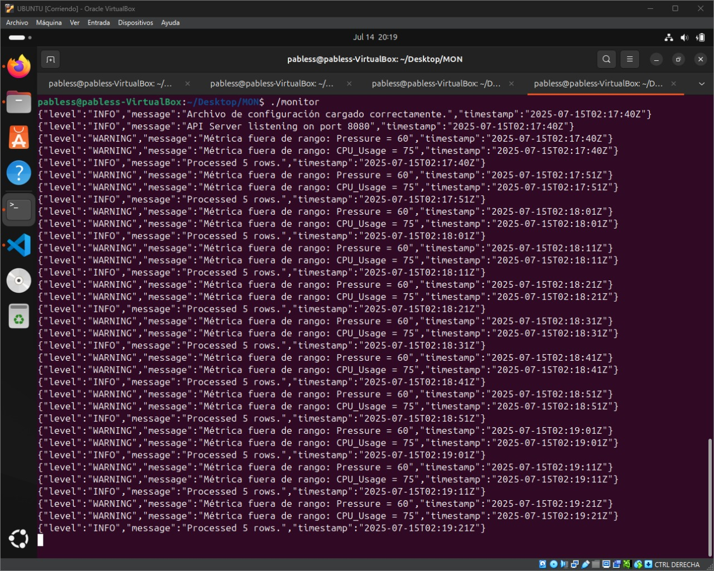
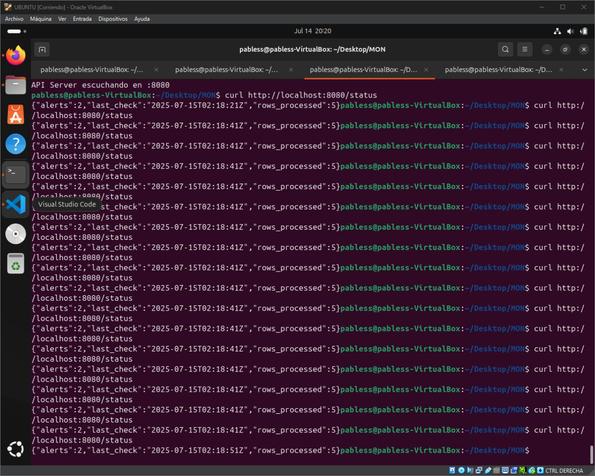
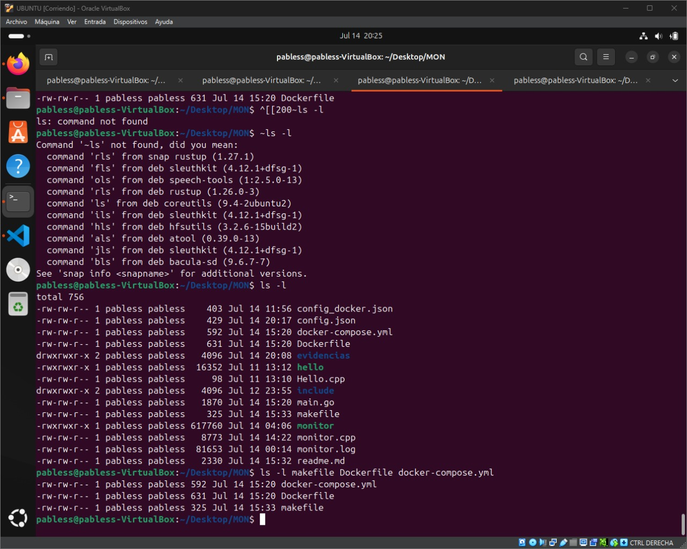
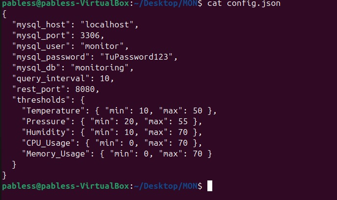
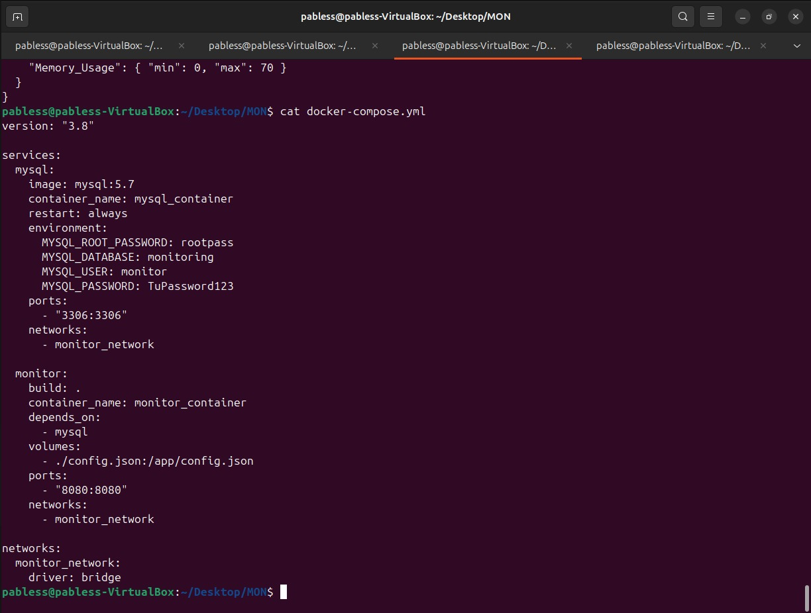
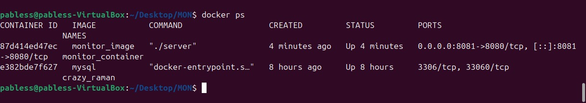

Sistema de Monitoreo
Este proyecto implementa un sistema de monitoreo con dos componentes principales:

Un monitor escrito en C++ que consulta métricas desde una base de datos MySQL.

Un servidor REST escrito en Go que expone las métricas y permite verificar el estado de salud del servicio.

Requisitos previos

Linux (Ubuntu 20.04 o superior recomendado)

g++ (C++17 compatible)

libmysqlcppconn (libmysqlcppconn-dev)

Go (versión 1.14 o superior)

MySQL Server (local o remoto)

Para instalar dependencias en Ubuntu ejecute:

sudo apt update
sudo apt install g++ libmysqlcppconn-dev golang-go mysql-monitor

Compilar y ejecutar en Linux

Clonar el repositorio o copiar los archivos al servidor Linux.

Configurar la base de datos:
Crear la base de datos y usuario en MySQL:
CREATE DATABASE monitoring;
CREATE USER 'monitor'@'%' IDENTIFIED BY 'TuPassword123';
GRANT ALL PRIVILEGES ON monitoring.* TO 'monitor'@'%';
FLUSH PRIVILEGES;
Actualizar config.json con los datos de conexión si es necesario.

Compilar el monitor en C++:
g++ -std=c++17 -o monitor monitor.cpp -lmysqlcppconn -lpthread

Compilar el servidor en Go:
go build -o monitor main.go

Ejecutar el servidor:
./monitor
El servidor escuchará en el puerto configurado (por defecto 8080).

 Ejecución del programa monitor mostrando carga correcta de configuración, alertas de métricas fuera de rango y procesamiento de datos en tiempo real

 Respuesta JSON de la API REST, mostrando el número de alertas activas, el timestamp de la última verificación y el total de filas procesadas.

Probar el servicio

Probar el endpoint /health:
curl http://localhost:8080/health
Respuesta esperada:
{"status": "UP"}

Probar el endpoint /metrics:
curl http://localhost:8080/metrics
Devuelve las métricas actuales obtenidas desde la base de datos.

 Archivos clave del proyecto: Makefile, Dockerfile y docker-compose.yml listos para la compilación y despliegue.

Probar recarga dinámica
El servicio detecta automáticamente cambios en el archivo config.json sin necesidad de reiniciar el servidor.

Editar config.json y modificar, por ejemplo, los umbrales de temperatura.

Guardar el archivo.

En el log del servidor se debe mostrar un mensaje indicando que la configuración fue recargada dinámicamente.

Consultar nuevamente /metrics para verificar que se aplicaron los nuevos valores.

 Configuración principal del sistema en config.json con parámetros de conexión a la base de datos y umbrales para monitoreo.

Docker
Para ejecutar con Docker y Docker Compose:
docker-compose up --build
Esto levantará un contenedor con MySQL y otro con el monitor y servidor REST.
El servicio estará disponible en http://localhost:8080

 Configuración del entorno con Docker Compose, definiendo los servicios, redes y volúmenes necesarios para el sistema de monitoreo.

 Listado de contenedores Docker activos mostrando el contenedor MySQL en ejecución.

Autor
Nombre: Juan Pablo Castro Dorantes
Proyecto: Sistema de monitoreo con C++ y Go

